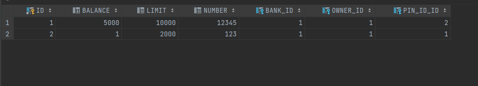

# Report: Software Technology Experiment 2

## Installation and JPA

### 1. Issues
ex1. Internal Exception: java.sql.SQLException: No suitable driver found
opening results
lombok

assertion error check family

## Experiments

### Experiment 1.1 - TODO

Table created by step 5 in the tutorial used for this assignment.

### Experiment 1.2 - Family

Table containing families.

Table containing people

Table containing jobs.

Join table containing person job relations.

Table of the sequence.

### Experiment 2

Overall structure.

Address table.

Bank table.

CreditCard table.

Join table of addresses and people.

Person table.

Pincode table.
## Pending issues
There was no issue encountered during the assignment that was not resolved.

