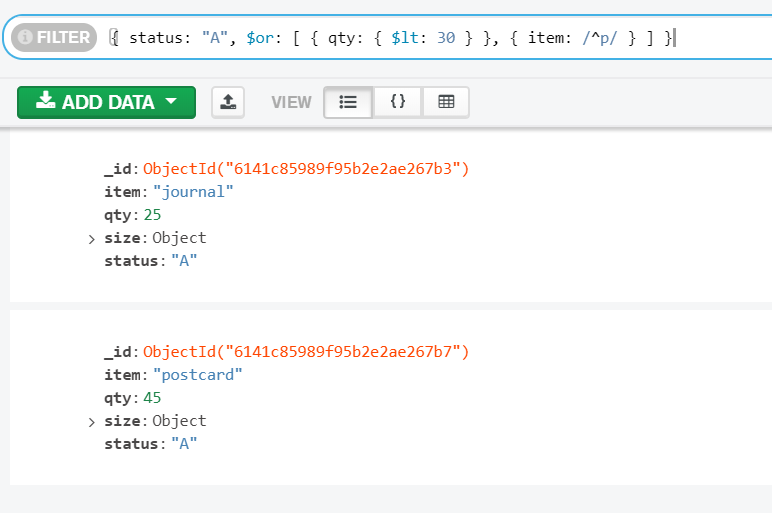

# Report: Software Technology Experiment 3

## Software Development Environment
This assignment requires MongoDB 4.4. However, a decision to use the current 5.0.2 version seemed reasonable. 
Therefore, that is the version that will be used for the duration of this assignment.

### 1.  Validating the installation package
Validating the installation package with SHA256

### 1. Installation of software
MongoDB 5.0.2 including compass was installed without any technical issues. 
Configured with MongoDB as a service that is run as network service user.  
In addition, the Mongo shell mongosh was installed separately.

No issues encountered in the installation process.

## MongoDB

### Experiment 1 - CRUD 

Insert operation insetMany() on the collection inventory, this creates the collection inventory if it does not already exist. 
Uses find to query the collection inventory to show that the insert worked as expected.

Performing query on the inventory collection within compass. 

Performing update with $set. If fields exist they are updated according to the input, 
if the field(s) does not exist they are created for the documents in question. 

A snippet from the query that show the effect of the update above.

Performing deleteMany() with a condition. In this case the condition was status: "A". 
In our example the collection was reduced from 15 documents to 10.

Performing an ordered bulkWrite() with replaceOne, deleteOne, updateOne, and insertOne.
The operation returns the result in the snippet above.

### Experiment 2

Defines the functions
1) mapFunction1 that maps the price and the cust_id for each document and emit cust_id and price.
2) the corresponding reducing function reduceFunction1 whose argument valuesPrices is an array with price values, and argument keyCustId groups the array.

MapReduce with the functions we defined above. 
The Warning in green is due to using mongoDB 5.0.2. MapReduce is being depreciated on versions after 4.4.

Query on the resulting map_reduce_example collection to show that result.

Defines the functions
1) mapFunction1 that maps the price and the ord_date for each document and emit ord_date and price.
2) the corresponding reducing function reduceFunction1 whose argument valuesPrices is an array with price values, and argument keyOrdDate groups the array.

MapReduce with the functions we defined above.

Query on the resulting map_reduce_example2 collection to show that result.

This last map reduce is my implementation. It is useful from a company standpoint as it allow them to check the daily turnover.
The knowledge can be crucial to the business strategy.

The result show a large fluctuation from day to day in the turnover sum. 
The dataset only look at 6 dates, thus the larger picture might show a full picture of the turnover trend in this business.

### Pending issues
No, no pending issues encountered.