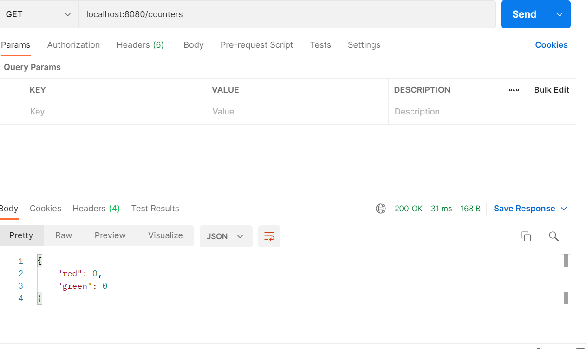
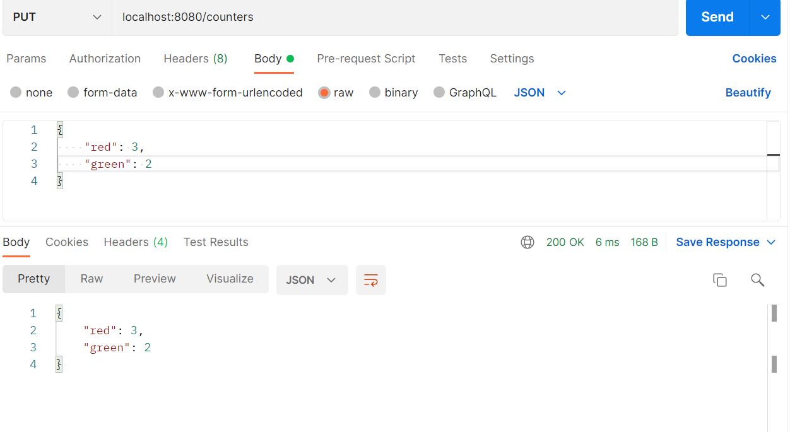

# Report: Software Technology Experiment 4

## Software Development Environment
This assignment requires the following software technology:
- Spark/java framework
- The postman tool
- Swagger

### 1. Installation of software
All technology needed to complete the assignment was already pre-installed.

## Experiments

### Experiment 1 - Spark/Java Framework project and Postman 
[source code.](https://github.com/KjerstiDA/expass4-1)

The was some problems with deploying the service as the coled project came with eclipse configurations, 
while deployment was attempted with IntelliJ. 
This was solved by deleting .idea and opening the repository through pom.xml.

GET

PUT

### Experiment 2 REST API for TODO-items
[source code.](https://github.com/KjerstiDA/expass4-2)

### Pending issues

No, no pending issues encountered.