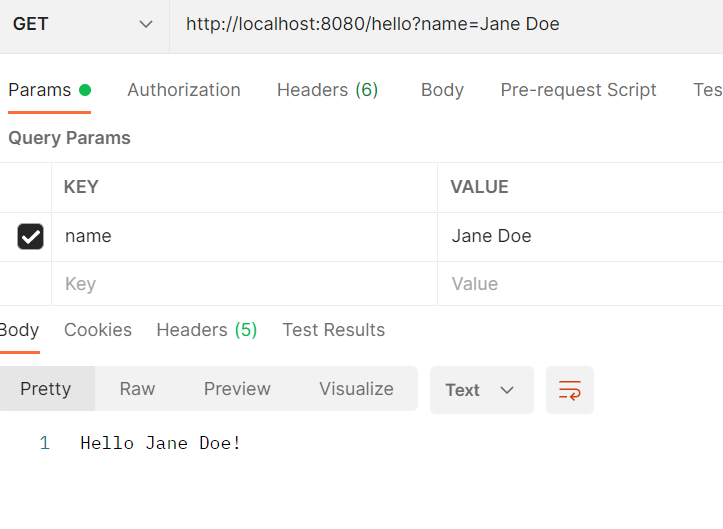
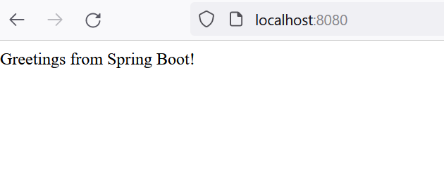
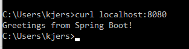
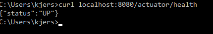
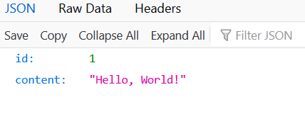
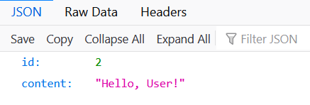
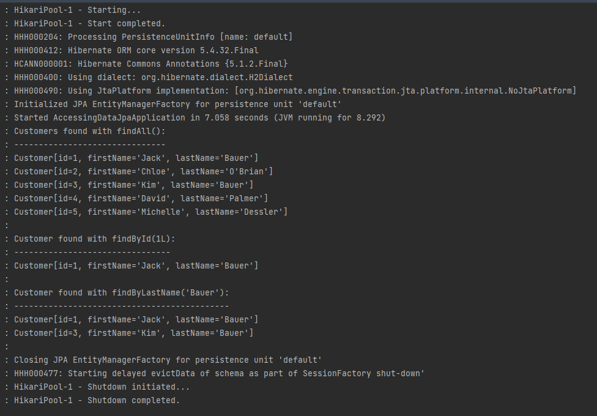

# Report: Software Technology Experiment 5

[source code](https://github.com/KjerstiDA/expass5-1-3) for experiment 1-3

## Experiment 1 

###Technical issues
There were some issues with the Java version, 
however by installing JDK 17 and updating JAVA_HOME path the issue was resolved.
## Experiment 2

###Technical issues
There were problems installing spring boot CLI, but this was resolved.

## Experiment 3

###Technical issues
None.

## Experiment 4
[source code](https://github.com/KjerstiDA/expass5-4)
git C:\Users\kjers\OneDrive\Documents\gs-accessing-data-jpa\complete

### Pending issues
None, all problems during the experiments was solved.