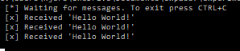
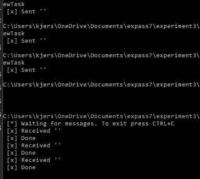
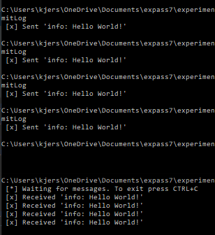

# Report: Software Technology Experiment 5
[source code](https://github.com/KjerstiDA/expass7)
## Experiment 1
Installed RabbitMQ

###Technical issues
Installation was slow but otherwise no problems.

## Experiment 2

###Technical issues
No issues

## Experiment 3

###Technical issues
None.

## Experiment 4

###Technical issues
None.

### Pending issues
None, all problems was solved during the experiment